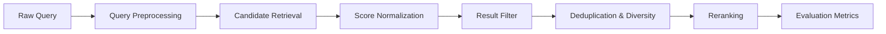
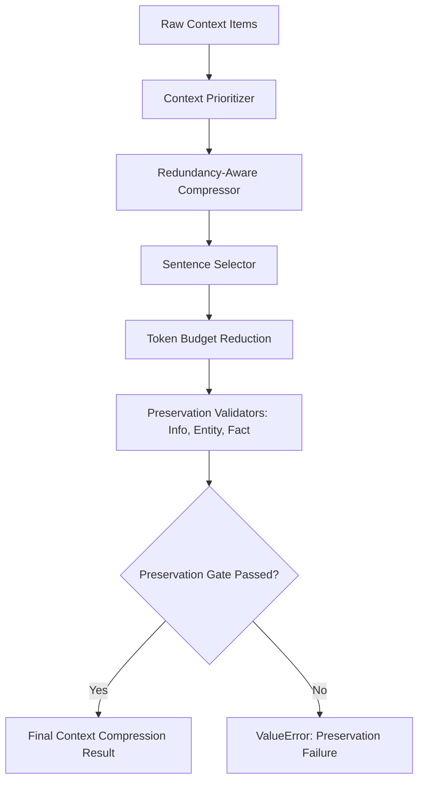

# NOLQERA

<p align="center">
  
</p>

<p align="center">
  <b>A From-Scratch Natural Language Processing (NLP) Engine & Intelligence Suite</b>
</p>

<p align="center">
  <a href="https://github.com/mogesh-developer/NOLQERA"></a>
  <a href="LICENSE"></a>
  <a href="https://github.com/mogesh-developer/NOLQERA"></a>
  <a href="https://github.com/mogesh-developer/NOLQERA"></a>
  <a href="https://github.com/mogesh-developer/NOLQERA"></a>
</p>

---

## 📌 Table of Contents

- [About NOLQERA](#-about-nolqera)
- [Architecture & Engine Design](#-architecture--engine-design)
- [Key Features](#-key-features)
- [Installation](#-installation)
- [Quickstart Guide](#-quickstart-guide)
- [NOLQERA Intelligence Suite](#-nolqera-intelligence-suite)
- [Pipeline Adapters Suite](#-pipeline-adapters-suite)
- [Retrieval Quality Pipeline](#-retrieval-quality-pipeline)
  - [Query Preprocessing](#1-query-preprocessing)
  - [Score Normalization](#2-score-normalization)
  - [Candidate Retrieval](#3-candidate-retrieval)
  - [Result Filtering](#4-result-filtering)
  - [Deduplication \& Diversity](#5-deduplication--diversity)
  - [Reranking \& Evaluation](#6-reranking--evaluation)
- [Context Optimization Pipeline](#-context-optimization-pipeline)
  - [Near-Duplicate \& Semantic Redundancy](#1-near-duplicate--semantic-redundancy)
  - [Redundant Info Collapse \& Noise Detection](#2-redundant-info-collapse--noise-detection)
  - [Importance Separation \& Context Ranking](#3-importance-separation--context-ranking)
  - [Final Context Scoring](#4-final-context-scoring)
  - [Extractive Summarization](#5-extractive-summarization)
  - [Context Prioritization](#6-context-prioritization)
  - [Redundancy-Aware Compression](#7-redundancy-aware-compression)
  - [Sentence Selection \& Token Budget Reduction](#8-sentence-selection--token-budget-reduction)
  - [Preservation Verification Gates](#9-preservation-verification-gates)
  - [Final Context Compressor](#10-final-context-compressor)
- [Development \& Testing](#-development--testing)
- [Roadmap](#-roadmap)
- [License](#-license)

---

## 🚀 About NOLQERA

**NOLQERA** is a lightweight, high-performance NLP engine built from fundamental mathematical algorithms rather than wrapping high-level monolithic libraries. 

It is designed to give complete visibility into how text cleaning, tokenization, TF-IDF vectorization, Naive Bayes/Logistic Regression classification, entity extraction, intent recognition, semantic similarity engines, retrieval quality pipelines, and context compression optimization work under the hood.

> [!IMPORTANT]
> **Zero Heavy Wrapper Dependencies**: NOLQERA's core algorithms run with zero bloat, pure mathematical precision, and full test coverage (**920+ verified unit & integration tests**).

---

## 🏗 Architecture & Engine Design

NOLQERA is structured into modular layers, separating core text features from the intelligence suite, pipeline adapters, retrieval quality, and advanced context optimization:

```mermaid
flowchart TD
    RawText[Input Raw Text] --> Preprocess[Preprocessing Pipeline]
    Preprocess --> Tokenize[Tokenization & Features]
    
    subgraph Core ML
        Tokenize --> NB[Naive Bayes]
        Tokenize --> LR[Logistic Regression]
    end
    
    subgraph Intelligence Suite
        Tokenize --> Relevance[Relevance Engine]
        Tokenize --> Importance[Importance Engine]
        Tokenize --> Keyphrase[Keyphrase Engine]
        Tokenize --> Entities[Entity NER Engine]
        Tokenize --> Intent[Intent Classifier]
        Tokenize --> Semantic[Similarity Engine]
    end
    
    subgraph Pipeline Adapters
        Intelligence Suite --> PipelineAdapters[NOLQERA Pipeline Adapters]
    end

    subgraph Retrieval Quality & Context Optimization
        PipelineAdapters --> RetrievalQuality[Retrieval Quality Pipeline]
        PipelineAdapters --> ContextOptimization[Context Optimization & Preservation]
    end
```

---

## ✨ Key Features

| Capability | Component | Description | Status |
| :--- | :--- | :--- | :---: |
| **Preprocessing** | `nolqera.preprocessing` | HTML stripping, URL removal, stemming, lemmatization | 🟢 `Done` |
| **Tokenization** | `nolqera.tokenization` | Sentence & Word tokenizers (Emoji, contraction & Tanglish support) | 🟢 `Done` |
| **Vectorization** | `nolqera.features` | BoW, N-Grams, Mathematical TF-IDF Vectorizer with IDF smoothing | 🟢 `Done` |
| **Classification** | `nolqera.classification` | Multinomial Naive Bayes, Logistic Regression | 🟢 `Done` |
| **Intelligence Suite** | `nolqera.intelligence` | Relevance, Importance, Keyphrase, NER, Intent, and Similarity Engines | 🟢 `Done` |
| **Pipeline Adapters** | `nolqera.intelligence.pipeline` | Standardized adapters for relevance, importance, keywords, NER, intent, noise removal, ranking, compression | 🟢 `Done` |
| **Retrieval Quality** | `nolqera.intelligence.retrieval_quality` | Query preprocessing, score normalization, candidate retrieval, filtering, diversity, reranking, and evaluation metrics | 🟢 `Done` |
| **Context Optimization** | `nolqera.intelligence.context_optimization` | Deduplication, redundancy collapse, noise filtering, context ranking, extractive summarization, prioritizer, token reduction, preservation gates, and final context compressor | 🟢 `Done` |

---

## 💻 Installation

NOLQERA requires **Python 3.11+**.

```bash
# Clone repository
git clone https://github.com/mogesh-developer/NOLQERA.git
cd NOLQERA

# Create virtual environment
python -m venv venv

# Activate Virtual Environment
# Windows PowerShell:
venv\Scripts\activate
# Linux/macOS:
source venv/bin/activate

# Install in editable mode with development dependencies
pip install -e ".[dev]"
```

---

## ⚡ Quickstart Guide

```python
from nolqera import preprocess, Tokenizer, TfidfVectorizer

# 1. Clean raw text
clean_text = preprocess("Check out NOLQERA at https://github.com/mogesh-developer/NOLQERA!")
print("Cleaned:", clean_text)

# 2. Tokenize into sentences and words
tokenizer = Tokenizer()
sentences = tokenizer.sentences("FastAPI is fast. MongoDB stores persistent data.")
words = tokenizer.words("Hello world! How are you?")
print("Sentences:", sentences)
print("Words:", words)

# 3. Compute TF-IDF Features
documents = [
    ["fastapi", "web", "framework"],
    ["mongodb", "nosql", "database"],
    ["fastapi", "mongodb", "backend"],
]
tfidf = TfidfVectorizer()
vectors = tfidf.fit_transform(documents)
print("Vocabulary:", tfidf.vocabulary_list)
```

---

## 🧠 NOLQERA Intelligence Suite

NOLQERA features specialized intelligence engines designed for production NLP workflows.

<details>
<summary><b>1. Sentence Relevance Engine</b></summary>

Computes top-k sentence relevance scores against an incoming user query:

```python
from nolqera.intelligence.relevance import RelevanceEngine

engine = RelevanceEngine()
query = "What database does the application use?"
sentences = [
    "The application is built using FastAPI.",
    "The application uses MongoDB for data storage.",
    "Python is the programming language.",
]

results = engine.analyze(query, sentences)
print("Most Relevant:", results[0].sentence)
print("Relevance Score:", results[0].score)
```
</details>

<details>
<summary><b>2. Document Importance Engine</b></summary>

Extracts central sentences from a long document using TF-IDF density, position bias, and length normalization:

```python
from nolqera.intelligence.importance import ImportanceEngine

engine = ImportanceEngine()
document = [
    "FastAPI provides REST API endpoints.",
    "The application uses MongoDB for data storage.",
    "I travelled to Chennai yesterday.",
]

ranked = engine.analyze(document)
print("Top Sentence:", ranked[0].sentence, "| Importance Score:", ranked[0].score)
```
</details>

<details>
<summary><b>3. Keyphrase Extraction Engine</b></summary>

Extracts multi-word concepts, ranks them by TF-IDF & position, and removes overlapping redundant spans:

```python
from nolqera.intelligence.keyphrase import KeyphraseEngine

engine = KeyphraseEngine()
text = "The application uses FastAPI for REST APIs. MongoDB is used for persistent data storage."

keyphrases = engine.extract(text, top_k=3)
for kp in keyphrases:
    print(f"Rank {kp.rank}: {kp.phrase:<25} (Score: {kp.score:.4f})")
```
</details>

<details>
<summary><b>4. Named Entity Recognition Engine</b></summary>

Detects entity candidate spans, classifies entities (`PERSON`, `LOCATION`, `ORGANIZATION`), and resolves overlapping boundaries:

```python
from nolqera.intelligence.entities import EntityEngine

engine = EntityEngine()
text = "Dr John travelled to Chennai and studied at American College."

entities = engine.analyze(text)
for entity in entities:
    print(f"{entity.text:<20} {entity.entity_type:<15} Score: {entity.score:.4f}")
```
</details>

<details>
<summary><b>5. Intent Classification Engine</b></summary>

Extracts linguistic intent signals, combines evidence, and ranks user intent classifications:

```python
from nolqera.intelligence.intent import IntentEngine

engine = IntentEngine()
intents = engine.analyze("How does FastAPI work?")
print("Intent:", intents[0].intent, "| Confidence:", intents[0].score)
```
</details>

<details>
<summary><b>6. Semantic Similarity Engine</b></summary>

Measures semantic similarity between text tokens using customizable embedding providers (TF-IDF & Transformer models):

```python
from nolqera.intelligence.semantic_similarity import SemanticSimilarityEngine
from nolqera.intelligence.semantic_similarity.embeddings.tfidf import TFIDFEmbeddingProvider

# 1. Initialize & fit embedding provider
provider = TFIDFEmbeddingProvider()
provider.fit([
    ["fastapi", "backend", "api"],
    ["mongodb", "database", "storage"],
])

# 2. Run Semantic Similarity Engine
engine = SemanticSimilarityEngine(provider)
result = engine.compare(["fastapi", "backend"], ["fastapi", "api"])
print(f"Similarity: {result.score:.4f} | {result.text_a} <-> {result.text_b}")
```
</details>

---

## 🔌 Pipeline Adapters Suite

Located under `nolqera.intelligence.pipeline`, these lightweight adapters standardize inputs and outputs across pipeline components:

```python
from nolqera.intelligence.pipeline import (
    RelevanceAnalyzer,
    ImportanceAnalyzer,
    KeywordAnalyzer,
    EntityAnalyzer,
    IntentAnalyzer,
    NoiseRemover,
    ContextRanker,
    ContextCompressor,
)

# Relevance & Importance analysis
relevance_analyzer = RelevanceAnalyzer()
importance_analyzer = ImportanceAnalyzer()

relevance_scores = relevance_analyzer.analyze("query text", ["sentence 1", "sentence 2"])
importance_scores = importance_analyzer.analyze(["sentence 1", "sentence 2"])

# Noise removal & ranking
noise_remover = NoiseRemover()
context_ranker = ContextRanker(relevance_weight=0.6, importance_weight=0.4)

clean_sentences = noise_remover.remove(["sentence 1", "sentence 2"])
ranked_contexts = context_ranker.rank(clean_sentences, relevance_scores, importance_scores)

# Context compression adapter
compressor = ContextCompressor(max_sentences=2)
compressed = compressor.compress(ranked_contexts)
```

---

## 🛡️ Retrieval Quality Pipeline

Located under `nolqera.intelligence.retrieval_quality`, this pipeline enforces semantic sanity, normalizes search scoring metrics, filters out low-relevance results, and structures search quality evaluations.



<details>
<summary><b>1. Query Preprocessing</b></summary>

Preprocesses search queries to extract semantic root tokens by standardizing case, removing punctuation, and filtering stopwords:

```python
from nolqera.intelligence.retrieval_quality.query_preprocessing import preprocess_query

query = "What is the best way to deploy a FastAPI backend?!"
tokens = preprocess_query(query)
print("Tokens:", tokens)  # Output: ['best', 'way', 'deploy', 'fastapi', 'backend']
```
</details>

<details>
<summary><b>2. Score Normalization</b></summary>

Maps disparate raw retrieval scores into a strict, unified `[0.0, 1.0]` range using Min-Max scaling across candidates:

```python
from nolqera.intelligence.retrieval_quality.score_normalization import ScoreNormalizer
from nolqera.intelligence.semantic_search.models import SemanticSearchResult

results = [
    SemanticSearchResult(index=0, text="Doc A", score=0.4),
    SemanticSearchResult(index=1, text="Doc B", score=0.6),
    SemanticSearchResult(index=2, text="Doc C", score=0.8),
]

normalizer = ScoreNormalizer()
normalized = normalizer.normalize(results)
for doc in normalized:
    print(f"{doc.text}: Raw={doc.original_score} -> Normalized={doc.score}")
```
</details>

<details>
<summary><b>3. Candidate Retrieval</b></summary>

Fetches candidates matching a query based on a minimum overlap threshold of query tokens:

```python
from nolqera.intelligence.retrieval_quality.candidate_retrieval import CandidateRetriever
from nolqera.intelligence.semantic_search.models import SemanticSearchResult

candidates = [
    SemanticSearchResult(index=0, text="fastapi python backend web server", score=0.9),
    SemanticSearchResult(index=1, text="unrelated database table design", score=0.1),
]

retriever = CandidateRetriever(min_token_overlap=1)
matched = retriever.retrieve("fastapi backend", candidates)
print("Matched Candidates:", [m.text for m in matched])
```
</details>

<details>
<summary><b>4. Result Filtering</b></summary>

Prunes candidates failing to meet a minimum normalized similarity score threshold:

```python
from nolqera.intelligence.retrieval_quality.result_filter import ResultFilter
from nolqera.intelligence.semantic_search.models import SemanticSearchResult

results = [
    SemanticSearchResult(index=0, text="high quality match", score=0.95),
    SemanticSearchResult(index=1, text="low quality noise", score=0.32),
]

filtered = ResultFilter().filter(results, min_score=0.50)
print("Filtered results:", [f.text for f in filtered]) # Output: ["high quality match"]
```
</details>

<details>
<summary><b>5. Deduplication & Diversity</b></summary>

Reduces keyword redundancy and enforces diversity by calculating lexical overlap using Jaccard Similarity:

```python
from nolqera.intelligence.retrieval_quality.deduplication import deduplicate_results
from nolqera.intelligence.retrieval_quality.diversity import diversify_results
from nolqera.intelligence.semantic_search.models import SemanticSearchResult

results = [
    SemanticSearchResult(index=0, text="fastapi backend server", score=0.9),
    SemanticSearchResult(index=1, text="fastapi backend server", score=0.8), # Duplicate text
    SemanticSearchResult(index=2, text="fastapi backend services", score=0.7), # High similarity
]

deduped = deduplicate_results(results)
diversified = diversify_results(deduped, similarity_threshold=0.5)

print("Diversified:", [d.text for d in diversified])
```
</details>

<details>
<summary><b>6. Reranking & Evaluation</b></summary>

Enhances retrieval quality using keyword overlap weights and provides metrics like Precision@K, Recall@K, Hit Rate, and Mean Reciprocal Rank (MRR):

```python
from nolqera.intelligence.retrieval_quality.reranking import rerank_results
from nolqera.intelligence.retrieval_quality.evaluation import precision_at_k, mean_reciprocal_rank

results = [
    SemanticSearchResult(index=0, text="MongoDB database storage", score=0.9),
    SemanticSearchResult(index=1, text="Python backend framework", score=0.7),
]

# Rerank prioritizing "Python backend" query
reranked = rerank_results("Python backend", results, relevance_weight=0.5, keyword_weight=0.5)

# Calculate Precision@K
print("Precision@1:", precision_at_k(retrieved=[1, 0], relevant={1}, k=1))
```
</details>

---

## ⚙️ Context Optimization Pipeline

Located under `nolqera.intelligence.context_optimization`, this module maximizes the information density of LLM contexts by collapsing semantic redundancy, isolating signal from noise, ranking components by combined relevance & importance weights, reducing token budgets, and enforcing strict preservation verification gates.



<details>
<summary><b>1. Near-Duplicate & Semantic Redundancy</b></summary>

Identifies and removes duplicate textual representations using lexical Jaccard metrics and vector embedding distance checks:

```python
from nolqera.intelligence.context_optimization.near_duplicate import is_near_duplicate
from nolqera.intelligence.context_optimization.semantic_redundancy import detect_semantic_redundancy
from nolqera.intelligence.semantic_similarity.engine import SemanticSimilarityEngine
from nolqera.intelligence.semantic_similarity.embeddings.tfidf import TFIDFEmbeddingProvider

# 1. Lexical Near-Duplicate Check
print(is_near_duplicate("FastAPI is a Python framework.", "FastAPI is a Python framework!")) # True

# 2. Semantic Redundancy check using Embeddings
provider = TFIDFEmbeddingProvider()
provider.fit([["fastapi", "modern", "api", "framework", "python", "backend"]])
engine = SemanticSimilarityEngine(provider)

redundant = detect_semantic_redundancy(
    "FastAPI is a Python backend framework",
    "FastAPI is a modern Python API framework",
    engine,
    similarity_threshold=0.9
)
print("Is Semantically Redundant:", redundant) # True
```
</details>

<details>
<summary><b>2. Redundant Info Collapse & Noise Detection</b></summary>

Collapses multiple redundant items into single representative items, and filters out low-information strings (such as strings composed entirely of punctuation or missing alphanumeric tokens):

```python
from nolqera.intelligence.context_optimization.redundant_information_collapse import collapse_redundant_information
from nolqera.intelligence.context_optimization.noise_detection import NoiseDetector
from nolqera.intelligence.semantic_search.models import SemanticSearchResult

# Remove low-information / punctuation-only noise
detector = NoiseDetector(min_meaningful_tokens=2)
result = object.__new__(SemanticSearchResult)
object.__setattr__(result, "text", "!!! ??? ...")
print("Is Noise:", detector.is_noise(result)) # True
```
</details>

<details>
<summary><b>3. Importance Separation & Context Ranking</b></summary>

Splits retrieved blocks into important and unnecessary components based on thresholds, and scores contexts using combined relevance & importance weights:

```python
from nolqera.intelligence.context_optimization.importance_separation import ImportanceSeparator
from nolqera.intelligence.context_optimization.context_ranking import ContextRanker
from nolqera.intelligence.semantic_search.models import SemanticSearchResult

results = [
    SemanticSearchResult(index=0, text="JWT Auth Security details", score=0.9),
    SemanticSearchResult(index=1, text="Creator biography notes", score=0.2),
]

# Separate by Importance
separator = ImportanceSeparator(importance_threshold=0.5)
important, unnecessary = separator.separate(results)

# Rank contexts using weights
ranker = ContextRanker(relevance_weight=0.7, importance_weight=0.3)
ranked_contexts = ranker.rank(results, importance_scores=[0.95, 0.15])
```
</details>

<details>
<summary><b>4. Final Context Scoring</b></summary>

Fuses relevance, diversity, and redundancy signals into a unified contextual metric used to index and select final search results:

```python
from nolqera.intelligence.context_optimization.final_context_scoring import FinalContextScorer
from nolqera.intelligence.semantic_search.models import SemanticSearchResult

scorer = FinalContextScorer(relevance_weight=0.6, diversity_weight=0.3, redundancy_weight=0.1)
result = SemanticSearchResult(index=0, text="React frontend details", score=0.85)

final_score = scorer.score(result, diversity=0.9, redundancy=0.05)
print("Final Context Score:", final_score.score)
```
</details>

<details>
<summary><b>5. Extractive Summarization</b></summary>

Extracts central representative sentences to summarize large contexts under strict sentence count constraints without text generation:

```python
from nolqera.intelligence.context_optimization.extractive_summarization import ExtractiveSummarizer

summarizer = ExtractiveSummarizer(max_sentences=2)
summary_result = summarizer.summarize(ranked_contexts)

print("Summary Text:", summary_result.text)
print("Sentences Retained:", len(summary_result.selected))
```
</details>

<details>
<summary><b>6. Context Prioritization</b></summary>

Establishes deterministic priority ordering over ranked contexts using a 4-tier tie-breaking hierarchy: `ranking_score` -> `importance_score` -> `relevance_score` -> `result.index`:

```python
from nolqera.intelligence.context_optimization.context_prioritization import ContextPrioritizer

prioritizer = ContextPrioritizer(descending=True)
prioritized = prioritizer.prioritize(ranked_contexts)
top_contexts = prioritizer.select_top(ranked_contexts, limit=3)
```
</details>

<details>
<summary><b>7. Redundancy-Aware Compression</b></summary>

Composes exact duplicate, near duplicate, semantic redundancy, and redundant information checkers into a unified compressor:

```python
from nolqera.intelligence.context_optimization.redundancy_aware_compression import RedundancyAwareCompressor

def exact_duplicate_checker(first: str, second: str) -> bool:
    return first.strip() == second.strip()

compressor = RedundancyAwareCompressor(exact_duplicate_checker=exact_duplicate_checker)
result = compressor.compress(ranked_contexts)
print("Retained Count:", len(result.selected), "| Removed Redundant Count:", len(result.removed))
```
</details>

<details>
<summary><b>8. Sentence Selection & Token Budget Reduction</b></summary>

Limits sentence counts while preserving original context order, and applies greedy token budget reduction with custom token counters:

```python
from nolqera.intelligence.context_optimization.sentence_selection import SentenceSelector
from nolqera.intelligence.context_optimization.token_reduction import TokenReductionStrategy

# 1. Sentence selection preserving source order
selector = SentenceSelector(max_sentences=3)
selected_result = selector.select(ranked_contexts)

# 2. Greedy token budget reduction
def word_counter(text: str) -> int:
    return len(text.split())

token_strategy = TokenReductionStrategy(token_counter=word_counter)
token_result = token_strategy.select(selected_result.selected, budget=100)
print("Compressed Tokens:", token_result.compressed_tokens, "| Reduction:", f"{token_result.reduction_percentage:.2f}%")
```
</details>

<details>
<summary><b>9. Preservation Verification Gates</b></summary>

Validates that important information, entities, and numeric/percentage facts are preserved in compressed contexts:

```python
from nolqera.intelligence.context_optimization.information_preservation import InformationPreserver
from nolqera.intelligence.context_optimization.entity_preservation import EntityPreserver
from nolqera.intelligence.context_optimization.fact_preservation import FactPreserver

# Information Preservation Validator
info_preserver = InformationPreserver(importance_threshold=0.70)
info_res = info_preserver.validate(original_contexts, compressed_contexts)

# Entity Preservation Validator
def entity_extractor(text: str):
    return [e for e in ["Python", "FastAPI", "MongoDB"] if e.casefold() in text.casefold()]

entity_preserver = EntityPreserver(entity_extractor=entity_extractor)
entity_res = entity_preserver.validate(original_contexts, compressed_contexts)

# Fact & Number Preservation Validator (supports numbers, decimals, percentages)
fact_preserver = FactPreserver(preserve_percentages=True)
fact_res = fact_preserver.validate(original_contexts, compressed_contexts)

print("Preserved:", info_res.is_preserved and entity_res.is_preserved and fact_res.is_preserved)
```
</details>

<details>
<summary><b>10. Final Context Compressor</b></summary>

Orchestrates the entire Phase 4 compression pipeline, enforcing strict preservation gates:

```python
from nolqera.intelligence.context_optimization.final_context_compressor import FinalContextCompressor
from nolqera.intelligence.context_optimization.redundancy_aware_compression import RedundancyAwareCompressor
from nolqera.intelligence.context_optimization.token_reduction import TokenReductionStrategy

compressor = FinalContextCompressor(
    redundancy_compressor=RedundancyAwareCompressor(exact_duplicate_checker=exact_duplicate_checker),
    token_reduction_strategy=TokenReductionStrategy(token_counter=word_counter),
    entity_extractor=entity_extractor,
    max_sentences=3,
    importance_threshold=0.70,
    require_preservation=True,
)

final_result = compressor.compress(ranked_contexts, token_budget=50)
print("Final Context Text:", final_result.text)
print("Preserved All Gates:", final_result.is_preserved)
```
</details>

---

## 🧪 Development & Testing

NOLQERA is built using strict test-driven development (TDD) with over **920+ unit and integration tests** validating math, constraints, and pipelines.

```powershell
# Run the complete test suite
pytest -v

# Run specific test suites
pytest tests/test_final_context_compressor.py -v -s
pytest tests/test_fact_preservation.py -v -s
pytest tests/test_entity_preservation.py -v -s
pytest tests/test_information_preservation.py -v -s
pytest tests/test_redundancy_aware_compression.py -v -s
```

---

## 🗺 Roadmap

- [x] **Phase 1 — Classical NLP Foundation**: Preprocessing, Stemming, Lemmatization, Tokenization, BoW, TF-IDF.
- [x] **Phase 2 — Text Statistics & Vocabulary**: Vocabulary Manager (`UNK`), Readability scores, Lexical Diversity (TTR).
- [x] **Phase 3 — Machine Learning NLP**: Naive Bayes, Logistic Regression (Gradient Descent, Cross-Entropy), Metrics & Reports.
- [x] **Phase 4 — NOLQERA Intelligence Suite**: Relevance, Importance, Keyphrase, Entity, Intent, and Semantic Similarity Engines.
- [x] **Phase 5 — Retrieval Quality & Context Optimization**: Precision/Recall metrics, candidate filters, Jaccard diversity, redundancy collapsing, importance separation, context ranking, extractive summarizer, token reduction, preservation gates, final context compressor.
- [ ] **Phase 6 — Neural Embeddings**: Custom Word2Vec (Skip-gram, CBOW), Dense Vector Store.
- [ ] **Phase 7 — Transformers & RAG**: Attention mechanisms, Vector Search Indexing, RAG Pipeline.

---

## 📄 License

Distributed under the **MIT License**. See [`LICENSE`](LICENSE) for details.

---

<p align="center">
  <b>NOLQERA</b> • <i>Learn NLP. Build NLP. Understand NLP.</i>
</p>
